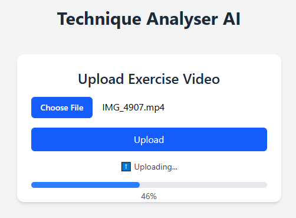

# 🏋️‍♂️ Technique Analyser AI

An AI-powered web app that analyses your **squat technique** from a video and provides a score along with rep-by-rep feedback on key biomechanics like **depth**, **knee angle**, and **torso positioning**. (Video must be from a side on angle)

📤 Upload video of your set → 🔍 Let the model analyse → ✅ Get your score and suggestions!

🔗 **Live App**: [https://joshpanebianco-io.github.io/technique-analyser-ai/](https://joshpanebianco-io.github.io/technique-analyser-ai/)

---

## 🚀 Tech Stack

### 🧠 Backend

- **FastAPI** — lightweight and fast web framework for Python
- **MediaPipe** — pose detection and landmark tracking
- **OpenCV** — video processing and frame extraction
- **NumPy** — numerical calculations
- **Uvicorn** — lightning-fast ASGI server

### 💻 Frontend

- **React.js** — declarative UI with stateful feedback
- **Tailwind CSS** — utility-first styling
- **XMLHttpRequest** — file uploads with progress tracking

---

## 🎯 Objectives

- Gain practical experience working with **pose estimation & AI models**
- Use **MediaPipe** to extract biomechanical insights
- Understand how to build and deploy fullstack AI apps using **Python (FastAPI)** and **React**
- Experience deploying on **Render** (API) and **GitHub Pages** (Frontend)

---

## ⚙️ Functionality

- **Upload Exercise Video** — accepts `.mp4` or any standard video format
- **Real-time Upload Progress** — animated progress bar and spinner
- **AI-Powered Feedback** — includes:
  - Set-level score
  - Summary of key movement faults (e.g., depth, posture)
  - Rep-by-rep analysis
- **CORS Support** — cross-domain API integration between GitHub Pages and Render

---

## 📱 Mobile Experience

- Mobile-responsive upload form
- Upload videos from mobile library
- Smooth UI animations during upload and analysis
- Collapsible and scrollable rep-by-rep breakdown for better UX on smaller screens

---

## 📸 Screenshots

Here’s a preview of the app in action:

### Upload


---

## 🛠 Installation (Dev Setup)

### Backend (FastAPI)

```bash
cd backend
pip install -r requirements.txt
uvicorn main:app --reload

---


