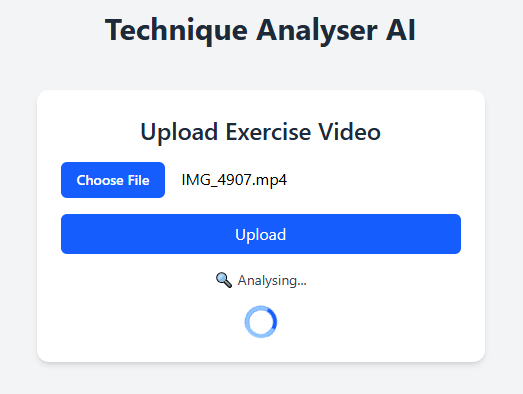
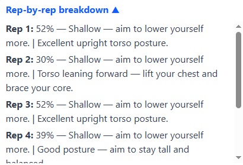

# 🏋️‍♂️ Technique Analyser AI

An AI-powered web app that analyses your **squat technique** from a video and provides a score along with rep-by-rep feedback on key biomechanics like **depth**, **knee angle**, **hip angle**, and **torso positioning**. (Video must be from a side on angle)

📤 Upload video of your set → 🔍 Let the application analyse  → ✅ Get your score and feedback!

🔗 **Live App**: [https://joshpanebianco-io.github.io/technique-analyser-ai/](https://joshpanebianco-io.github.io/technique-analyser-ai/) 

> ⚠️ **Note**: The backend is hosted on **Render's free tier** — it may take 1–2 minutes to spin up after inactivity.

---

## 🚀 Tech Stack

### 🧠 Backend

- **FastAPI** — lightweight and fast web framework for Python
- **MediaPipe** — pose detection and landmark tracking
- **OpenCV** — video processing and frame extraction
- **NumPy** — numerical calculations
- **Uvicorn** — lightning-fast ASGI server

### 💻 Frontend

- **React.js** — declarative UI with stateful feedback
- **Tailwind CSS** — utility-first styling
- **XMLHttpRequest** — file uploads with progress tracking

---

## 🎯 Objectives

- Gain practical experience working with **pose estimation**
- Utilize **MediaPipe** to extract detailed biomechanical insights
- Explore **real-time** processing and visualization of pose data
- Understand challenges in accuracy, latency, and robustness in **pose estimation** models
- Experiment with custom **model** fine-tuning and integration of sensors

---

## ⚙️ Functionality

- **Upload Exercise Video** — accepts `.mp4` or any standard video format
- **Real-time Upload Progress** — animated progress bar and spinner
- **AI-Powered Feedback** — includes:
  - Set-level score
  - Summary of key movement faults (e.g., depth, posture)
  - Rep-by-rep analysis

---

## 📱 Mobile Experience

- Mobile-responsive upload form
- Upload videos from mobile photo library, files or record a video
- Smooth UI animations during upload and analysis
- Collapsible and scrollable rep-by-rep breakdown for better UX on smaller screens

---

## 📸 Screenshots

Here’s a preview of the app in action:

  
  
  
  

